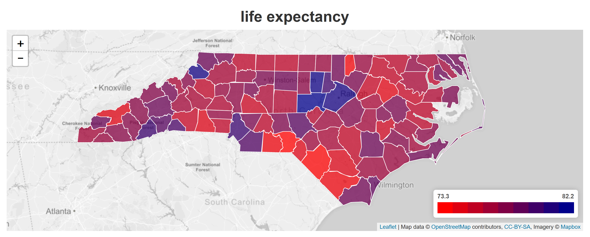

# A Choropleth Map of North Carolina Counties

A choropleth map is a chart that depicts geographic regions, with each region displayed with colors that are related to certain statistical quantities. In this project, the counties of North Carolina are displayed in a choropleth map in accordance with a variety of quantities such as life expectancy, population, health, education level to name but a few.
<p align="center">
      
</p>


## Flask Application ##

The choropleth map presented here is created by executing a python-based Flask application, namely ```flaskapp.py```. The map itself is built using JavaScript code together with certain features made available in the ```leaflet.js``` and ```plotly.js``` libraries. The flask application uses data that is extracted from a pre-populated PostgreSQL database using SQLAlchemy commands. Thus, in order for the Flask application to run it is necessary to build the PostgreSQL database using the Python code identified in the sections that follow:

## Database Creation ##
The ```./dbcreate``` folder contains all the files required to generate tables within a Postgres SQL database called ‘Project3’. 
It is recommended that this name be used because the application that generates the choropleth plots contains code that assumes ‘Project3’ is the name of the SQL database. 
The string required for the SQLAlchemy connection to the database is contained in the file ```dbconfig.py```. 
In particular, the user should review the password contained in this file and configure it to match his/her personal Postgres password.
<br>
The individual tables are now listed along with the corresponding creation software together with a data file (if appropriate). The data files are also contained in the ```./dbcreate``` folder. At the very least, the 'NC Counties' table should be created beacuse this table contains data pertaining to the geometry of each county boundary as well as the name of each county.
Note that both ```pandas``` and ```geopandas``` should be installed in the host environment.

### NC Counties ###
contains the FIPS code, name and geometry of each county in NC. It is created by running the ```LifeExpectancySQL``` notebook. The geometry of each county is stored as a polygon (sometimes a multi-polygon) that was sourced from data downloaded from Eric Celeste's website: https://eric.clst.org/tech/usgeojson.

### NC Life Expectancy ###
contains an estimate of the average life expectancy of individuals born in each NC county. It is also created by running the ```LifeExpectancySQL``` notebook. This data was sourced from www.countyhealthrankings.org, and is the fruit of a program sponsored by the Robert Wood Johnson Foundation.

### NC Drugs ###
contains a yearly death rate due to drug poisoning for each county. It is created by running the ```drug_poisoning``` notebook.

### CountyStrikes ###
is a data set that contains the total number of lightning strikes in each NC county during 2018. It is created by running the script ```process_data.py```, which makes use of data contained in ```raw-lightning.json.bz2```. The data was sourced from a Google BigQuery dataset from NOAA concerning lightning strikes.

### NC Cardiovascular Fatality Rate ###
contains the cardiovascular fatality rate (per 100,000 people) for each county. It is created bt running the notebook ```SonalSQL```, which imports data contained in ```CVFatality.csv```.

### NC Census Data ###
contains a miscellany of census data obtained for each county in NC, including population, population immigration for 2018, education level, poverty level and much more. It is created by running the notebook ```CensusData``` which imports data contained in ```ProjectData.csv```.

## Executing the Flask App ##

Prior to executing the Flask app, it will be necessary to have an installation of the ```Flask``` and ```SQLAlchemy``` Python libraries in the host environment. The ```numpy``` and ```pandas``` Python libraries are also required. 
<br>
<br>
In order to generate the map layer, it is necessary to supply a mapbox access token (available from https://account.mapbox.com/auth/signup/). The access token should be added to the ```API_KEY``` string inside the file ```./static/js/conifg.js```.
<br>
<br>
The Flask app can now be executed simply by typing the following at the command prompt:
<br>
```python flask.app```
<br>


## Future Work ##

It is intended that the project be extended in order to create choropleth maps that encompass every state in the United States.
It is also anticipated that future work for this project will involve creating choropleth maps with even more detail. This will require examining data that is available for each 'census tract'.
A census tract is a geographic region defined for the purpose of taking a census. The underlying region will tend to have a population of between 2,500 and 8,000. 

<p align="center">
      
</p>

<p align="center">
    <strong>Cencus tracts for Mecklenburg County, NC</strong>
</p>

## Acknowledgments ##

Much of the data used for this project has been made available by Eric Celeste. Much gratitude goes to Eric.
Eric Celeste's website is: https://eric.clst.org/tech/usgeojson. Particular use has been made of the county boundary data stored in GeoJSON form - ```gz_2010_us_050_00_500k.json```

